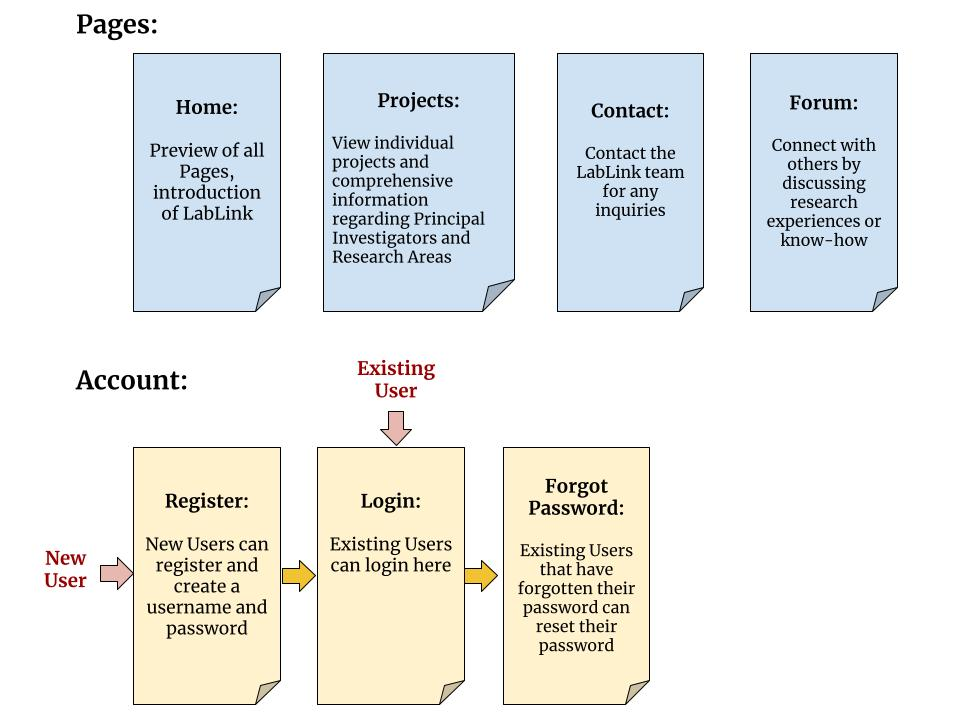

# LabLink
A platform connecting CS students at Emory with research opportunities. LabLink aims to simplify and centralize the search for research positions, making it easier for students to get involved and for professors to find passionate individuals.

## Deployment and Installation

It is deployed on vercel. Therefore, no installation is necessary for now. 
Android users: There is an APK downloadable 
## Audience-facing Documentation
# Welcome to the LabLink! User Guide

**Are you:**
- A curious student looking for research opportunities at Emory University?
- A professor looking to recruit driven students to your research lab?
- A member of the Emory community looking to learn more about Emory Computer Science?

**Then you’re at the right place!**

## Technical Documentation

List of files / folders here:
### LabLink/src/components/:
**jsons/**: Directory containing JSON files for mongodb transfer and data handling.

**Contact.js**: Implements the Profile Page feature.

**Error.js**: Contains CSS styling rules.

**Forum.js**: Updates to user access privilege settings.

**Home.js**: Home Page Javascript File.

**Login.js**: Login Page Javascript File.

**Navbar.js**: Navigation Bar Javascript File.

**News.js**: News Page Javascript File.

**ProfessorSample.json**: Json template for Professor Data Dictionary.

**Professors.js**: Professors Page Javascript File.

**Profile.js**: User Profile Page Javascript File.

**ReactComponent.js**: React for adding Professor information to Professors page using props.

**Register.js**: Register Page Javascript File.

**ResetPass.js**: Reset Password Page Javascript File.
- Defines React component ResetPass for a password reset feature.
- Manages its state with hooks for change indication, data, loading, error, user input for netID, and email content.
- Uses a function to handle form submission, which validates the netID, generates a verification code, sends an email to the user's Emory address with the code, and then navigates to a verification page.

**SingleProf.js**: Test / Sample Page for Single Professor Page Javascript File.

**test.js**: A basic implementation for sending emails.

**test2.js**: Test file for experimenting with local storage and session storage.

**verify.js**: Enhancements to the CSS for the verification process.
We appreciate your feedback!

### LabLink/src/styles/:

**forum.css**: style for body, main, div, h2, ul, li, li:hover, li:reply, li.reply:before ..., and button

**login.css**: style for login page

**navbar.css**: style for navigation bar

**reset.css**: style for reset password page

**verify.css**: style for ???

